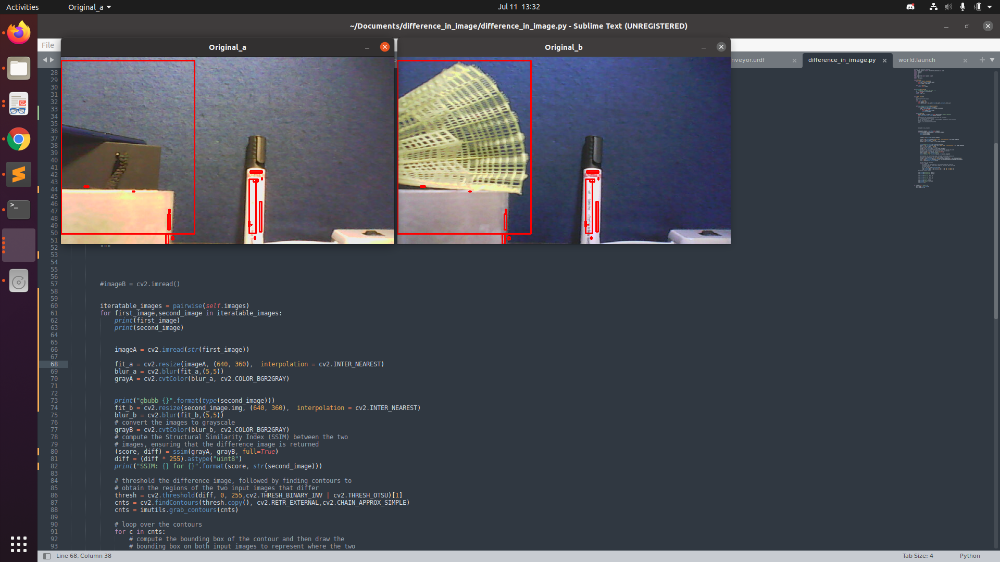
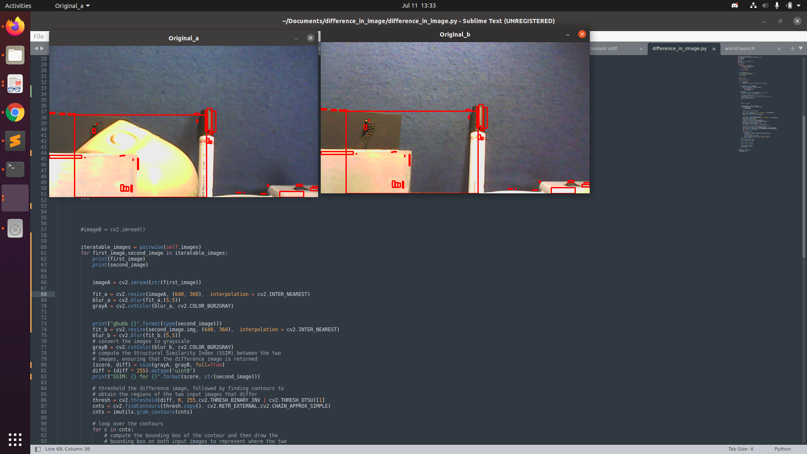

https://scikit-image.org/docs/dev/auto_examples/transform/plot_ssim.html
https://towardsdatascience.com/image-classification-using-ssim-34e549ec6e12
https://www.pyimagesearch.com/2014/09/15/python-compare-two-images/
https://stackoverflow.com/questions/189943/how-can-i-quantify-difference-between-two-images
https://www.pyimagesearch.com/2017/06/19/image-difference-with-opencv-and-python/

When comparing images, the mean squared error (MSE)–while simple to implement–is not highly indicative of perceived similarity. 
Structural similarity aims to address this shortcoming by taking texture into account 

The code manages to identify the differences accurately, further improvements can be made in reducing the false positives
